# CSCI 5050 UI Design

**Project:**  2D Floorplan Vectorizer  
**Team:** Amr Barakat, Nidhi Sankhe, Srinath Muppala, Chetan Badiger, Harini Padamata

---

## 1. Overview

The **2D Floorplan Vectorizer** web application is the primary workspace for uploading, reviewing, annotating, and exporting 2D floor plan data. The interface is designed to accept floor plan inputs such as **PNG images** and **PDF files**, organize them within a project session, and guide the user through a workflow that converts visual layouts into structured outputs.

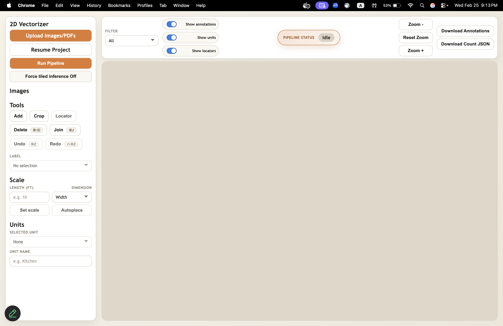

From this workspace, a user can:

- Start a new project or resume an existing one.
- Upload a floor plan image or PDF.
- Run the processing pipeline, including inference-based detection when enabled.
- Review generated detections and annotations on an interactive canvas.
- Manually correct, refine, or add annotations.
- Define real-world scale and unit information so measurements are meaningful beyond pixel coordinates.
- Export final outputs such as annotation JSON, room-boundary JSON, and count summaries.

The interface also communicates the **current pipeline status** so the user always knows whether the system is idle, processing, or ready for export.

---

## 2. Main Workspace Description

The landing page serves as the central working area for the application. It uses a **canvas-first layout** with a left-side control panel and a top utility bar.

### Left-side control panel
The left panel contains the main controls for:

- Uploading images or PDFs
- Resuming a project using previously saved annotations
- Running the pipeline
- Enabling or disabling tiled inference
- Viewing uploaded files
- Using manual editing tools such as **Add**, **Crop**, **Locator**, **Delete**, **Join**, **Undo**, and **Redo**
- Assigning labels to selected annotations
- Defining scale using a real-world wall dimension
- Setting units and naming units or rooms

### Top utility bar
The top bar provides controls for:

- Filtering visible detections
- Showing or hiding annotations, units, and locators
- Viewing pipeline status
- Zooming in, zooming out, and resetting zoom
- Downloading annotations
- Downloading count summaries in JSON format

### Main canvas
The center canvas displays the uploaded floor plan and acts as the primary review and editing area. This is where users:

- View the uploaded image or PDF page
- Inspect generated detections
- Crop the region of interest
- Edit room boundaries
- Add or remove annotations
- Review labels and locator placement

---

## 3. UI Image Descriptions

### 3.1 Initial landing page
The landing page presents a clean, workspace-oriented interface with an empty central canvas, a left-side panel for project and annotation controls, and a top toolbar for visibility settings, pipeline status, zoom controls, and export actions.

### 3.2 Uploaded image with crop mode
After an image is uploaded, the selected floor plan is shown on the canvas. When the **Crop** tool is active, the user can define a rectangular region of interest directly on the canvas using a draggable dashed outline. This allows the user to isolate the relevant portion of the floor plan before further annotation or vectorization.

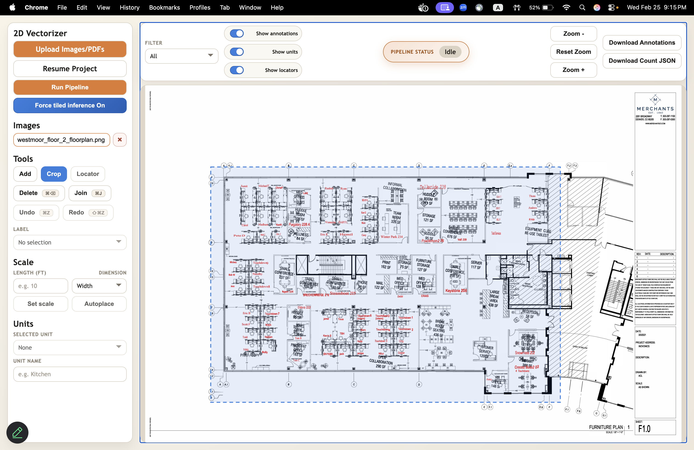
### After crop
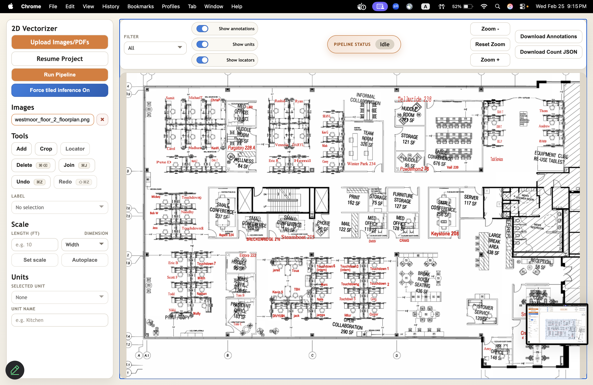

### 3.3 Resume project behavior
If the user uploads a previous annotation file, the application restores the earlier detections and overlays them on the current floor plan. This allows the user to continue editing instead of restarting the annotation process from scratch.

### after resuming the project
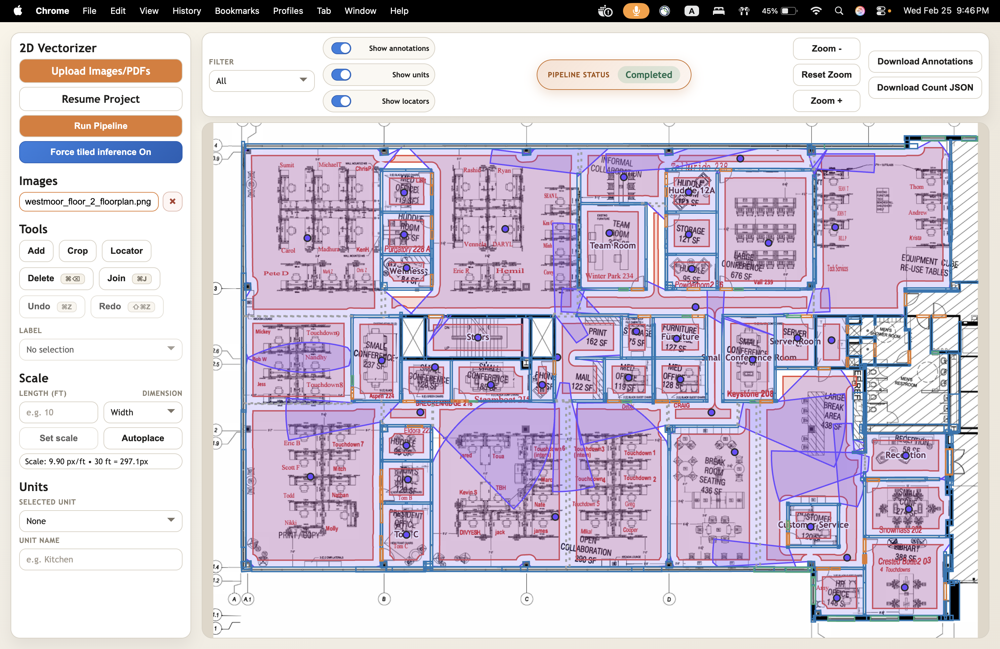

### 3.4 Room labels and filtered overlays
After room labels are added, the labels are displayed directly on the canvas and saved in the database. The user can also choose which categories of detections are visible on the canvas, allowing them to focus on only the layers they need, such as annotations, locators, or unit markers.

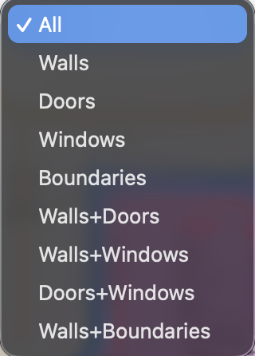
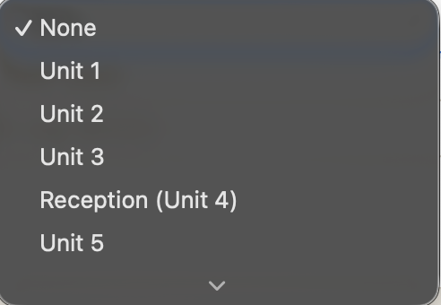

### 3.5 Alert on rerunning the pipeline
When the user reruns the pipeline with a new image, the application displays an alert indicating that the current analysis will be lost. This prevents accidental overwriting of existing work.

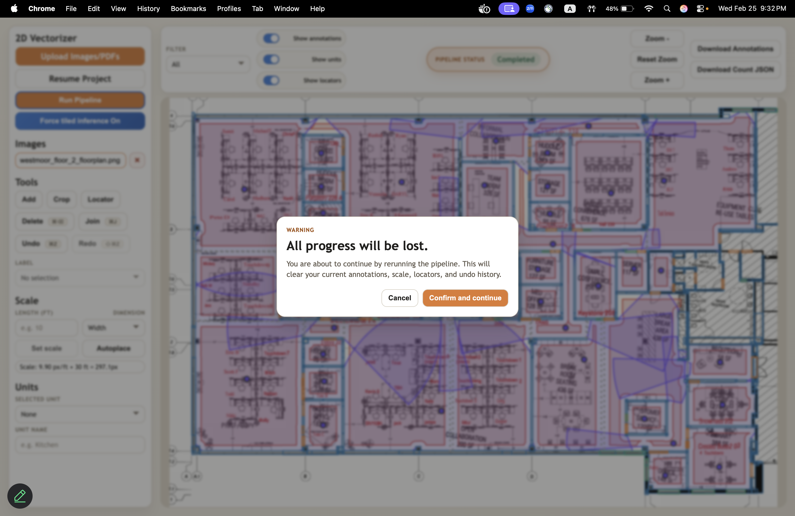

---

## 4. Core Workflow

1. **Upload a floor plan** in PNG or PDF format.  
2. **Display the selected input** on the main canvas.  
3. **Run inference** or **resume a project** using previously saved annotations.  
4. **Review generated wall, window, and door detections**.  
5. **Edit detections manually** if the system output is incomplete or incorrect.  
6. **Generate room boundaries** based on closed contours formed by the detected structural elements.  
7. **Refine room boundaries and labels** through direct editing on the canvas.  
8. **Define scale and locator placement** using a known real-world wall dimension.  
9. **Export structured outputs** such as annotations, room boundaries, and count summaries in JSON format.  

---

## 5. BDD Scenarios

### Scenario 1: Uploading a 2D Floor Plan
**Goal:** Ensure the system accepts supported floor plan files and stores them for processing.

**Given** the user is on the floor plan upload page  
**And** the system supports `.png` and `.pdf` file formats  
**When** the user uploads a valid floor plan image or PDF  
**Then** the system should successfully store the file  
**And** display the selected input on the canvas for review

**Notes:**  
The user can upload either a PNG image or a PDF file for inference. Once the file is selected, it becomes the active project input and is shown on the canvas.

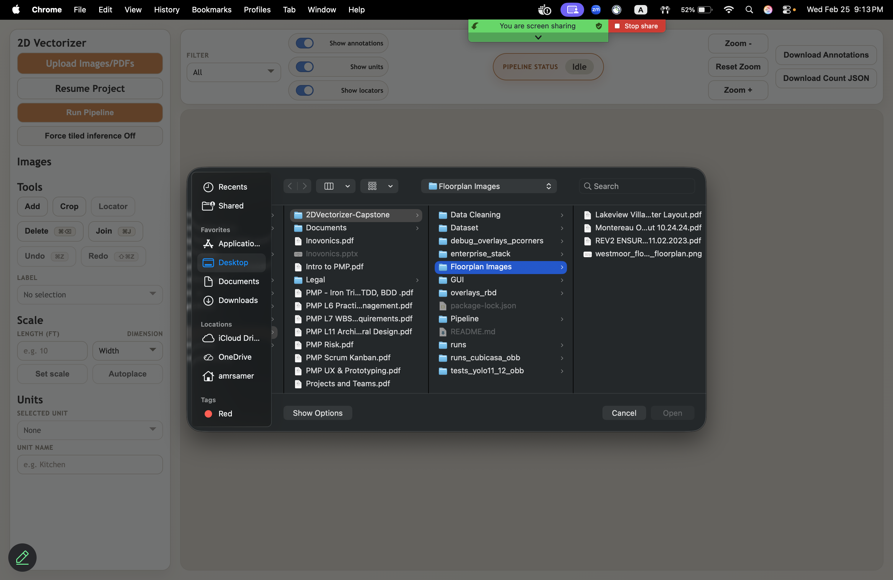
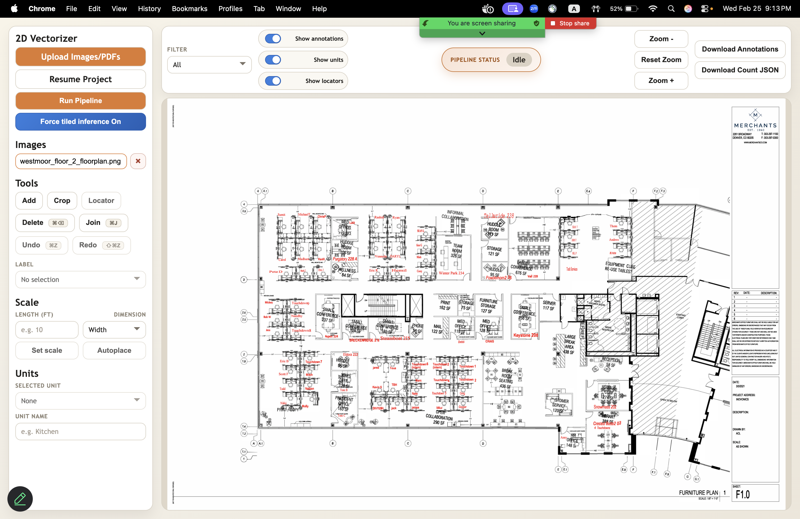

---

### Scenario 2: Manual or Existing Annotations
**Goal:** Support both automatic initialization and manual annotation workflows.

**Given** the floor plan image has been preprocessed successfully  
**And** the system checks for existing annotations linked to the uploaded floor plan  
**When** no annotations are found  
**Then** the user should be able to draw polygons, boxes, or structural annotations manually  
**And** label each region appropriately  
**And** save these annotations using the floor plan's unique project or file ID

**And When** the user chooses to run inference  
**Then** the system should detect structural elements such as walls, windows, and doors  
**And** use those detections as the starting point for later room-boundary generation

**Notes:**  
The user is not limited to system-generated detections. They can manually add or correct walls, windows, doors, and other annotation elements through the tools panel.

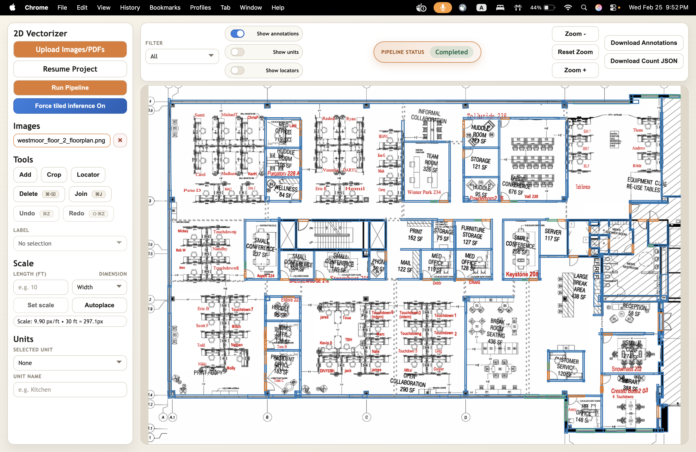

---

### Scenario 4: Detecting Room Boundaries
**Goal:** Convert structural detections into room-like enclosed regions.

**Given** the annotated or preprocessed floor plan image is available  
**When** the room-boundary detection module is executed  
**Then** the system should identify closed or continuous contours representing likely room boundaries  
**And** ignore non-room elements where possible, such as text, furniture graphics, and decorative symbols  
**And** overlay the detected boundaries on the image for visual verification

**Notes:**  
The room-boundary algorithm uses the available structural detections to find closed regions. In practice, it does not strictly distinguish between walls, doors, and windows during contour closure; instead, it looks for usable closed boundaries and renders the resulting room outlines, typically in red.

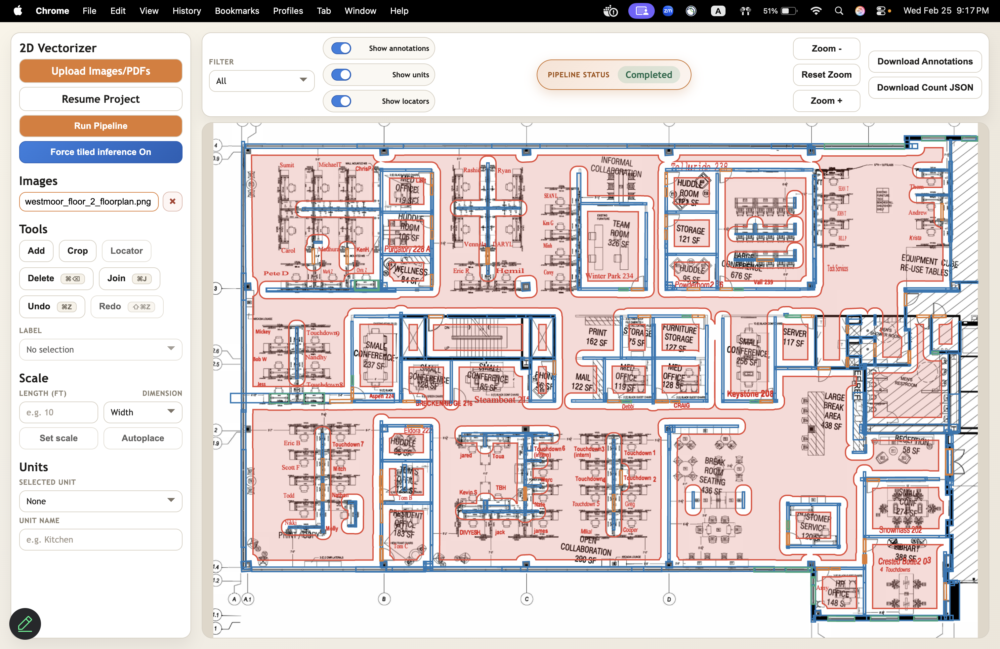

### The user can delete unwanted detections and edit the room boundaries

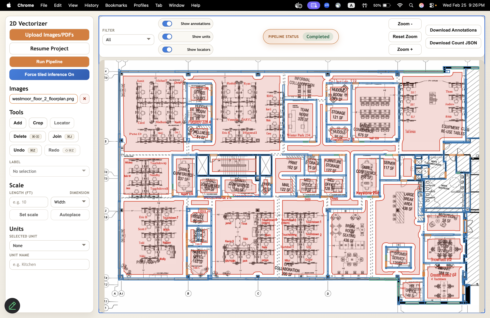

### add room labels for the detected room boundaries.

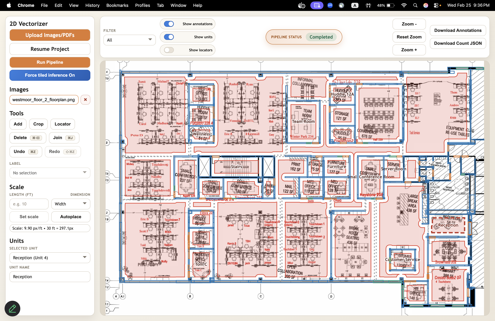
---

### Scenario 4: Exporting Detected Layouts
**Goal:** Ensure users can export the processed layout in a usable structured format.

**Given** the room boundaries and supporting annotations have been finalized  
**When** the user selects an export option  
**Then** the system should generate downloadable output files  
**And** ensure the exported data accurately reflects the current canvas state

**Notes:**  
Based on the current UI and project description, the primary export flow is centered on **JSON outputs**, including:

- Annotation JSON
- Room-boundary JSON
- Component count JSON

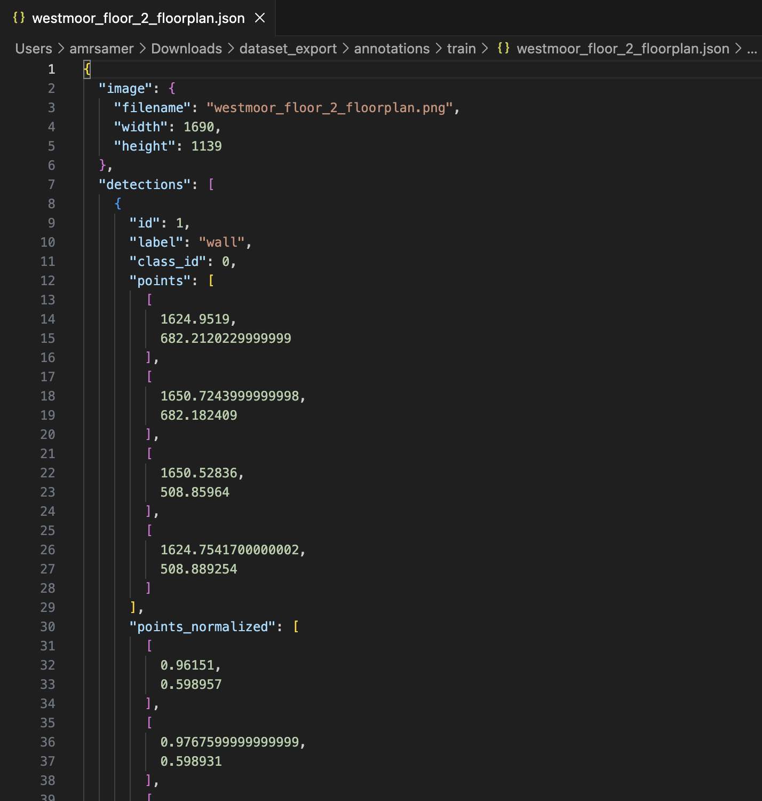
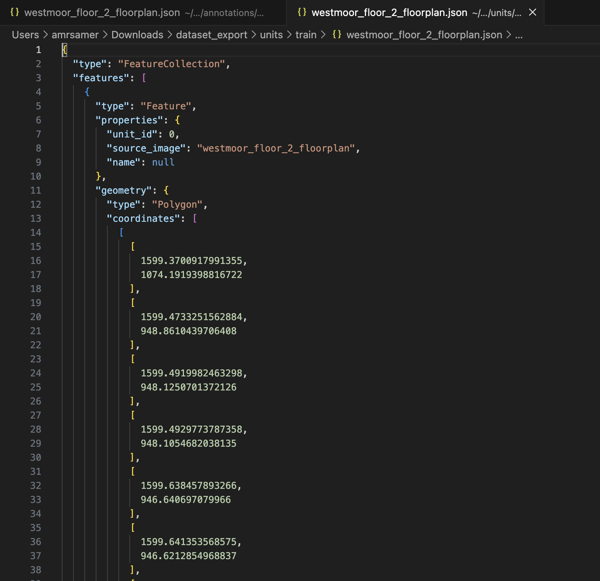
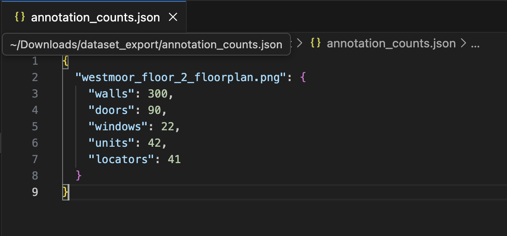

---

### Scenario 5: Defining Scale and Locator Placement (This is the new feature the sponsors requested)
**Goal:** Convert the floor plan from pixel space into a real-world spatial layout.

**Given** the user knows at least one real-world wall dimension  
**When** the user enters the length of a reference wall and applies scale  
**Then** the system should calibrate the floor plan to real-world units  
**And** place locators based on the configured device range

**Notes:**  
In the current design, locators are placed using a configurable coverage radius (described by the team as approximately **30 meters**, depending on the chosen scale). The user is expected to provide a known outer or major wall dimension so that the application can convert the drawing into meaningful spatial measurements. Locator positions can also be manually edited, deleted, or added.

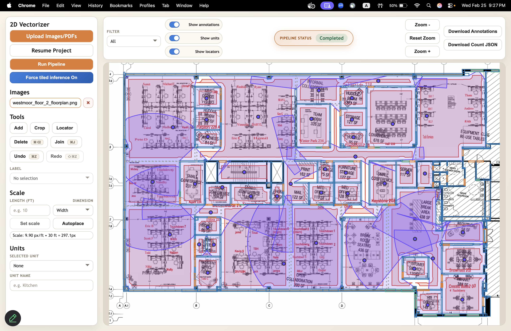
### editing or adding or deleting the locators
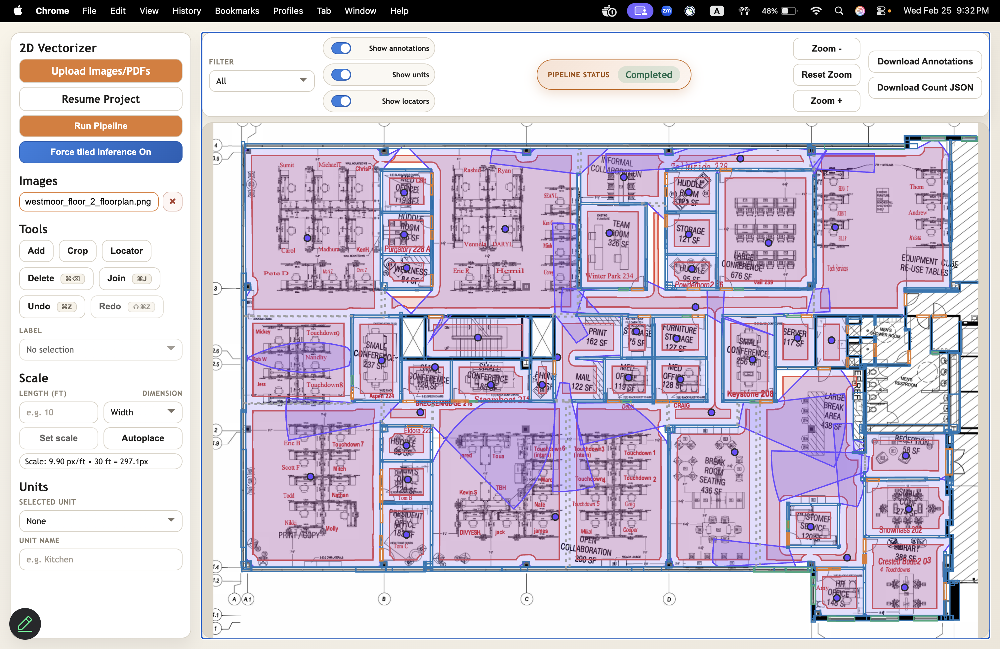

---

## 6. Output Data Descriptions

### 6.1 Room boundary JSON
This JSON output contains the structured representation of detected rooms, including:

- Coordinates for each room boundary
- The room label
- A reference to the source image or floor plan

This file is used to preserve the geometric shape and semantic identity of each detected room.

### 6.2 Component count JSON
This JSON output contains summary counts for detected objects in the floor plan, such as:

- Rooms
- Walls
- Windows
- Doors
- Locators

This file provides a compact summary of the analyzed layout and is useful for reporting or downstream application logic.

### 6.3 Anotation JSON
 This JSON output contains the Yolo OBB bounding boxes in JSON format.

 class 0 - Walls
 class 1 - Windows
 class 2 - Doors

---

## 7. Design Notes and Accuracy Clarifications

- The system appears to be **JSON-first** in its current export workflow, even if additional export formats are discussed conceptually.
- Room-boundary generation is based on **closed contour detection** from structural annotations, not on semantic architectural reasoning.
- The user plays an important role in the workflow by correcting false positives, refining room boundaries, and assigning labels.
- Locators depend on accurate scale calibration, so the correctness of the real-world measurement step directly affects locator placement.
- The application supports both **fresh inference workflows** and **resume-from-annotations workflows**, which is important for iterative annotation projects.

---

## 8. Conclusion

The 2D Vectorizer UI is designed as an interactive annotation and review environment for converting floor plan documents into structured spatial data. Its combination of automated inference, manual correction tools, room-boundary generation, scale calibration, and exportable JSON outputs makes it suitable for iterative layout analysis workflows where both automation and user validation are required.

